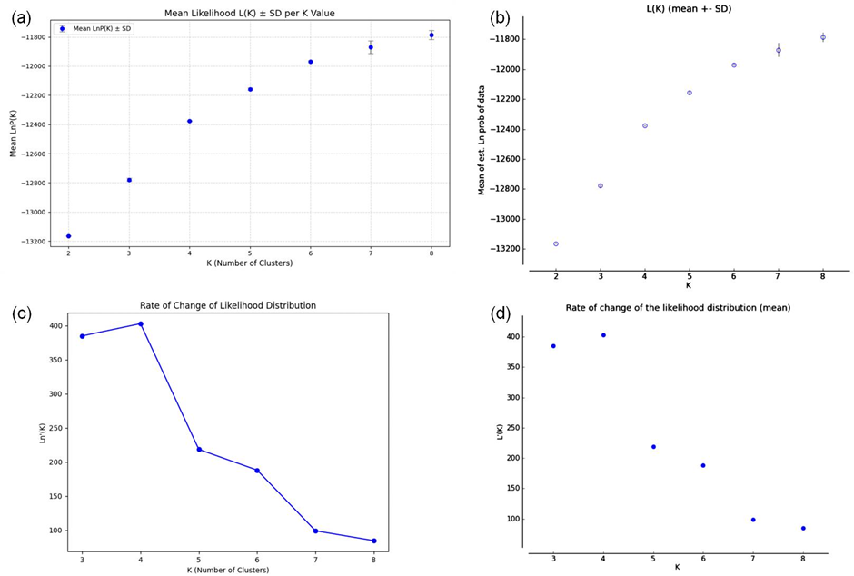

**Summary**

Analysis of genetic population structure using the software STRUCTURE is fundamental in genetics, but determining the optimal number of clusters (K) remains a significant challenge. The widely used tool STRUCTURE HARVESTER, which implements the Evanno method to estimate K, is currently non-functional, and alternative tools often require internet access or advanced programming skills, creating accessibility and data privacy issues. To overcome these limitations, we developed HarvestEase GUI, a user-friendly, offline graphical interface designed to simplify and streamline the interpretation of STRUCTURE outputs. Written in Python with a Tkinter-based interface, HarvestEase GUI automates the calculation of ΔK using a modified and reliable implementation of the Evanno method. It automatically parses output files and extracts essential metrics, including mean log-likelihoods and standard deviations, presenting them in clear, interpretable graphs and Excel-compatible tables. To ensure computational accuracy, HarvestEase GUI was validated against a published dataset, producing results for mean likelihood, standard deviation, and ΔK that were identical to those from the original STRUCTURE HARVESTER. HarvestEase GUI is platform-independent, running seamlessly on Windows, macOS, and Linux, and is packaged as a standalone executable to eliminate dependency management and the need for a pre-installed Python environment. By providing an intuitive, accurate, and fully offline tool, HarvestEase GUI enhances the accessibility of population structure analysis for researchers, particularly those with limited computational resources or internet connectivity. The software is freely available under an MIT open-source license.

**Statement of need**

Understanding genetic structure is fundamental in both population genetics and conservation biology, as it provides critical insights into genetic diversity, gene flow, and evolutionary dynamics, which are essential for assessing population viability, managing species conservation, and formulating effective biodiversity strategies [@kardos2021conservation; @ouborg2010integrating; @woodruff2004populations]. To uncover genetic differentiation among populations, computational programs such as STRUCTURE [@pritchard2000inference] have been widely used. This tool uses Bayesian clustering algorithms to infer the number of genetic clusters (K) within multi-locus genetic datasets. However, interpreting the outputs of STRUCTURE, particularly in determining the optimal number of clusters (K), often requires additional processing methods and tools. Without these tools, researchers may face significant challenges in making accurate interpretations of their results [@jakobsson2007clumpp; @maier2023limits].  One of the most widely accepted methods for determining the most likely number of genetic clusters (K) is the Evanno method [@evanno2005detecting], which estimates ΔK, a second-order rate of change in the log-likelihood values across successive K values. This method is implemented in a program called STRUCTURE HARVESTER [@earl2012structure], which has become a standard tool for processing and visualizing STRUCTURE output. However, this method is not without its limitations. Issues such as label switching, multimodality (i.e., the presence of multiple plausible clustering solutions for the same K), and the computational intensity required for multiple STRUCTURE runs can complicate analyses and hinder accurate interpretation [@buscicchio2019label; @jakobsson2007clumpp]. These challenges can lead to inefficiencies and errors in the analysis process, particularly when dealing with large datasets [@raj2014faststructure; @stift2019structure]. To address these challenges, several auxiliary tools have been developed. For instance, CLUMPP [@jakobsson2007clumpp] was introduced to align cluster labels across multiple STRUCTURE runs, effectively resolving the issue of label switching and ensuring consistent cluster identification. Other tools like fastSTRUCTURE [@raj2014faststructure], StrAuto [@chhatre2017strauto], and Easy Parallel [@zhao2020easyparallel] have significantly enhanced the efficiency of population genetic analyses by offering features like automation, parallelization, and accelerated computation. Despite their advantages, many of these tools still have limitations. They often require internet access, specialized computational environments, or lack of intuitive graphical interfaces, which makes them difficult to use for researchers without advanced programming skills or in settings with limited resources [@raj2014faststructure; @stift2019structure]. In the field of population genetics, several software solutions are available for inferring and visualizing genetic structure, including STRUCTURE [@pritchard2000inference], ADMIXTURE [@alexander2009fast], fastSTRUCTURE [@raj2014faststructure], and auxiliary tools such as CLUMPP [@jakobsson2007clumpp], StrAuto [@chhatre2017strauto], Easy Parallel [@zhao2020easyparallel], and STRUCTURE HARVESTER [@earl2012structure]. ADMIXTURE is widely recognized for its speed and ability to efficiently handle large genotype datasets using a maximum likelihood framework and PLINK file formats, while fastSTRUCTURE offers scalable Bayesian inference suitable for large SNP datasets [@raj2014faststructure; @stift2019structure]. STRUCTURE itself remains extensively cited and popular for its robust Bayesian modeling of genetic clustering, producing probabilistic individual ancestry assignments [@raj2014faststructure]. Auxiliary tools such as CLUMPP and StrAuto provide additional functionality for resolving label switching and automating STRUCTURE runs, while Easy Parallel helps parallelize these computationally intensive tasks. However, despite their usefulness, none of these tools provide an intuitive graphical interface focused specifically on interpreting and visualizing STRUCTURE outputs [@tidwell2010designing]. Furthermore, STRUCTURE HARVESTER, though widely used for determining the most probable number of clusters (K) using the Evanno method, appears to be non-functional at present [@stift2019structure]. Alternative online tools like StructureSelector (https://lmme.ac.cn/StructureSelector/) do offer similar functionality but require users to upload sensitive genetic data to remote servers, raising data privacy concerns and long-term accessibility issues [@hunter2018next]. Unlike ADMIXTURE and fastSTRUCTURE, which focus primarily on high-throughput data processing, and auxiliary tools like StrAuto and Easy Parallel that focus on automating STRUCTURE runs, HarvestEase GUI empowers users to focus on data interpretation and decision-making. This makes it particularly valuable for conservation biologists and population geneticists working in the field or in regions with limited computational resources [@hunter2018next; @willi2022conservation]. In conclusion, HarvestEase GUI offers a robust, accurate, and user-friendly solution for interpreting STRUCTURE outputs. By preserving the computational integrity of STRUCTURE HARVESTER while eliminating the need for advanced computing skills or constant internet access, it widens accessibility for users with varying levels of computational expertise. Furthermore, its open-source nature promotes flexibility and future adaptability to the scientific community. As the field of population genetics continues to evolve, future developments of HarvestEase GUI will focus on expanding compatibility with new data formats, enhancing visualization capabilities, and integrating advanced analytical features, ensuring its continued relevance in modern genetic research workflows. In summary, while other tools excel in data processing, automation, or advanced modeling, HarvestEase GUI provides a unique combination of computational accuracy, ease of use, offline functionality, broad OS compatibility, and enhanced data privacy, distinguishing itself as a superior and indispensable solution in the population genetics analysis toolkit [@hunter2018next].

**Functionality**

 HarvestEase GUI provides the following key features for processing and interpreting STRUCTURE outputs:

- Easy loading of STRUCTURE output files and automatic identification of the range of K values used.
- Computation of ΔK using a modified implementation of the Evanno method [@evanno2005detecting], producing identical results to STRUCTURE HARVESTER [@earl2012structure].
- Automatic extraction of essential metrics, including mean log-likelihood for each K value, standard deviations, and ΔK values.
- Presentation of metrics in interpretable graphs and Excel-compatible tables for efficient identification of the most probable number of genetic clusters (K).
- A simple, intuitive Tkinter-based graphical user interface that minimizes manual input and automates tasks like file parsing and metric extraction.
- Full     offline functionality, eliminating the need for internet access or advanced programming skills.
- Platform-independent design, compatible with Windows, macOS (only Apple Silicon M1 and later), and Linux, packaged as standalone executables via PyInstaller for easy installation without a pre-installed Python environment. These     implementations are straightforward to use and efficient, leveraging Python's simplicity while ensuring reliability through validation against published datasets.

**Examples**

A User Guide detailing the workflow in HarvestEase GUI is provided in the documentation in zenodo and google drive, along with examples demonstrating functionality and video tutorials for macOS. The full Python source code is available in the GitHub repository for customization and contributions. Here, we outline basic usage scenarios:

1. **Loading and Processing Outputs:** Users select STRUCTURE output files via the GUI. The tool automatically detects K ranges and computes ΔK [@evanno2005detecting]. Runtime for a typical dataset (e.g., [@Eriksen2014-xi]) is under 10 seconds on a standard machine, including metric extraction and graph generation. As a lightweight software, HarvestEase GUI does not require a high-end PC.
2. **Visualization:** Metrics like mean log-likelihood and ΔK are plotted in graphs, with tables exported to Excel format. For a dataset with K = 2 to 8, visualization takes ~2 seconds.
3. **Validation Comparison:** Using the [@Eriksen2014-xi] dataset, the tool generates identical mean likelihoods, standard deviations, and ΔK values as STRUCTURE HARVESTER (Figure 1, Table 1).

All examples are performed on standard hardware (12th Gen Intel(R) Core(TM) i5-1240P), with warm-up time excluded. For detailed code snippets and outputs, refer to the Example Gallery in the repository.

**Table 1:** Output of the Evanno method generated by HarvestEase GUI.

| K    | Reps | Mean LnP(K) | Stdev LnP(K) | Ln'(K) | \|Ln''(K)\| | Delta K  |
| ---- | ---- | ----------- | ------------ | ------ | ----------- | -------- |
| 2    | 10   | -13163.8    | 1.5224       | _      | _           | _        |
| 3    | 10   | -12778.76   | 10.7954      | 385.04 | 17.98       | 1.665526 |
| 4    | 10   | -12375.74   | 2.704        | 403.02 | 184.56      | 68.25472 |
| 5    | 10   | -12157.28   | 8.1334       | 218.46 | 30.35       | 3.731507 |
| 6    | 10   | -11969.17   | 5.6541       | 188.11 | 89.07       | 15.75313 |
| 7    | 10   | -11870.13   | 44.5762      | 99.04  | 14.4        | 0.323042 |
| 8    | 10   | -11785.49   | 30.4491      | 84.64  | _           | _        |

**Datasets**
One dataset is provided with HarvestEase GUI for testing and validation: a published STRUCTURE dataset from [@Eriksen2014-xi], which includes multi-locus genetic data for population clustering. This dataset was used to compare HarvestEase GUI outputs against STRUCTURE HARVESTER, confirming identical results for mean likelihoods, standard deviations, and ΔK values (Figure 1, Table 1). The dataset is available in the data folder on the GitHub repository and can be loaded directly via the GUI for demonstration purposes. All data is open-source and suitable for verifying computational accuracy.

**Usage in ongoing research** 

As of the writing of this paper, HarvestEase GUI is being utilized in ongoing projects focused on population genetics and conservation biology, including studies on genetic diversity in endangered species and biodiversity management in resource-limited regions. It has been applied in preliminary analyses for assessing gene flow in wildlife populations, where its offline capabilities and ease of use have proven valuable for field researchers. Future integrations are planned for broader workflows in genetic research, with contributions encouraged via the open-source repository.

